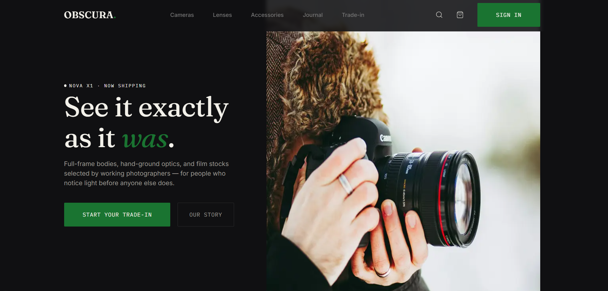

# Obscura

> Precision cameras, optics, and field gear for photographers who notice light first.

A dark-mode, editorial landing page for a fictional premium camera retailer. Built with Next.js 15 (App Router), Tailwind CSS v4, and TypeScript.

---

## Table of Contents

- [Tech Stack](#tech-stack)
- [Quick Start](#quick-start)
- [Project Structure](#project-structure)
- [Design System](#design-system)
- [Component Architecture](#component-architecture)
- [Data Layer](#data-layer)
- [Cart State](#cart-state)
- [Responsive Strategy](#responsive-strategy)
- [Deployment](#deployment)
- [Roadmap](#roadmap)

---

## Tech Stack

| Layer | Choice | Notes |
|---|---|---|
| Framework | **Next.js 15** (App Router) | Server Components, `next/image`, metadata API |
| Language | **TypeScript** | Strict mode |
| Styling | **Tailwind CSS v4** | CSS-first config via `@theme` in `globals.css` |
| Fonts | **next/font** | Fraunces · Inter · IBM Plex Mono — self-hosted, zero CLS |
| Icons | **lucide-react** + custom SVGs | Lucide for UI icons, custom SVGs for brand icons (Instagram, YouTube, Pinterest, X) |
| Utilities | **clsx** + **tailwind-merge** | Wrapped in a `cn()` helper |
| Deployment | **Vercel** | Zero-config, preview deployments |

---

## Quick Start

### Prerequisites

- Node.js 20+
- npm (or pnpm / yarn / bun)

### Install

```bash
npm install
```

### Dev server

```bash
npm run dev
```

Open [http://localhost:3000](http://localhost:3000).

### Production build

```bash
npm run build
npm start
```

### Lint

```bash
npm run lint
```

---

## Project Structure

```
obscura/
├── public/
│   ├── img-1.png              # Hero image (placeholder for real product photos)
│   └── og.png                 # Social share card (1200×630, TODO)
│
├── src/
│   ├── app/
│   │   ├── layout.tsx         # Root layout — fonts, metadata, <html>
│   │   ├── page.tsx           # Landing page — composes all sections
│   │   ├── globals.css        # Tailwind directives + design tokens
│   │   │
│   │   └── components/
│   │       ├── sections/      # Page-specific compositions
│   │       │   ├── Navbar.tsx
│   │       │   ├── Hero.tsx
│   │       │   ├── CategoryGrid.tsx
│   │       │   ├── FeaturedGear.tsx
│   │       │   ├── AboutSection.tsx
│   │       │   ├── TradeInBanner.tsx
│   │       │   └── Footer.tsx
│   │       │
│   │       └── ui/            # Reusable primitives
│   │           ├── Button.tsx
│   │           ├── Badge.tsx
│   │           ├── Eyebrow.tsx
│   │           ├── IconButton.tsx
│   │           ├── CartBadge.tsx
│   │           ├── QuantityStepper.tsx
│   │           ├── Container.tsx
│   │           ├── CategoryCard.tsx
│   │           ├── ProductCard.tsx
│   │           ├── SocialIcons.tsx      # Brand icons (Lucide removed these)
│   │           ├── ObscuraWordmark.tsx  # SVG embossed footer wordmark
│   │           └── index.ts             # Barrel export
│   │
│   └── lib/
│       ├── cn.ts              # clsx + tailwind-merge helper
│       └── data.ts            # Mock data + types (swap for API later)
│
├── tsconfig.json
├── tailwind.config.ts         # (if using v3 — v4 config is in CSS)
├── next.config.ts
└── package.json
```

> **Note:** The project uses relative imports within `src/app/components/` (`../ui/Button`) rather than the `@/` alias. Both work — relative was chosen for consistency with the initial scaffold. If you prefer `@/`, update `tsconfig.json` paths and adjust imports.

---

## Design System

All tokens live in **`src/app/globals.css`** under `@theme`. Tailwind auto-generates utilities from these.

### Colors

| Token | Value | Usage |
|---|---|---|
| `--color-bg` | `#101012` | Page background |
| `--color-surface` | `#18181B` | Featured Gear, About section backgrounds |
| `--color-surface-alt` | `#1F1F23` | Product card image containers |
| `--color-footer` | `#0B0B0C` | Footer background |
| `--color-text` | `#F3F1EA` | Primary text (cream) |
| `--color-muted` | `#9C9A93` | Body text, secondary labels |
| `--color-placeholder` | `#757575` | Nav links, input placeholders |
| `--color-primary` | `#1A7431` | Green CTA |
| `--color-primary-hover` | `#155D27` | CTA hover state |
| `--color-divider` | `rgba(242, 240, 233, 0.12)` | Borders, dividers |

### Typography

| Role | Font | Weight | Size | Line-height | Letter-spacing |
|---|---|---|---|---|---|
| H1 (hero) | Fraunces | 400 | 70px | 78px | −0.704px |
| H2 section | Fraunces | 400 | 40px | 48px | −0.416px |
| H2 promo | Fraunces | 400 | 52px | 58px | −0.512px |
| H3 | Fraunces | 400 | 24px | 36px | −0.24px |
| Wordmark | Fraunces | 600 | 24px | 32px | 0.48px |
| Body | Inter | 400 | 16px | 24px | 0 |
| Nav | Inter | 500 | 14px | 22px | 0 |
| Caption / eyebrow | IBM Plex Mono | 400 | 12px | 20px | 1.613px |
| Button | IBM Plex Mono | 400 | 14px | 22px | 0.787px |
| Badge | IBM Plex Mono | 400 | 10.4px | 16px | 0.624px |

All three fonts are loaded via `next/font/google` in `src/app/layout.tsx` and exposed as CSS variables (`--font-fraunces`, `--font-inter`, `--font-ibm-plex-mono`) which map to Tailwind's `font-display`, `font-sans`, `font-mono`.

### Spacing

- **Content max-widths:** 1200px (Hero/Categories), 1184px (Featured Gear), 1273px (Footer content), 1365px (wordmark)
- **Section padding:** desktop ≈ 100px, mobile 48–64px
- **Card gaps:** 24–28px
- **Border radii:** 2px (cards, buttons), 8px (icon buttons), 18px / full (social circles)

---

## Component Architecture

### Primitives (`components/ui/`)

These map 1:1 to the Figma component sheet and are reused across sections.

| Component | Variants / Props | Notes |
|---|---|---|
| `Button` | `variant: "primary" \| "ghost" \| "nav"` | Handles all 3 button styles + hover states |
| `Badge` | `kind: "NEW" \| "REFURBISHED" \| "LIMITED"` | Green-outlined pill |
| `Eyebrow` | `centered?: boolean` | `● LABEL` in mono uppercase |
| `IconButton` | `label: string` (aria-label) | Wraps search/cart/account/menu |
| `CartBadge` | `count: number` | Green pill, auto-hidden at 0 |
| `QuantityStepper` | `value`, `onIncrement`, `onDecrement` | `− N +` control |
| `CategoryCard` | `category: Category` | Full-bleed image + gradient + bottom content |
| `ProductCard` | `product`, `quantity`, handlers | Two states: default (`+`) and added (`− N +`) |
| `Container` | `size?: "default" \| "wide"` | Max-width wrapper |

### Sections (`components/sections/`)

Composed of primitives. Page-specific, not reused elsewhere.

| Section | Interactive? | Notes |
|---|---|---|
| `Navbar` | ✅ Client | Mobile overlay, cart badge, scroll-locked body |
| `Hero` | ❌ Server | Static. Two-column on `lg`, stacked below |
| `CategoryGrid` | ❌ Server | 1 / 2 / 3 columns |
| `FeaturedGear` | ✅ Client | Product cards with cart interaction |
| `AboutSection` | ❌ Server | Text + image, stacked on mobile |
| `TradeInBanner` | ❌ Server | Radial gradient promo |
| `Footer` | ❌ Server | 4 groups + wordmark SVG |

---

## Data Layer

**Location:** `src/lib/data.ts`

Currently mock data. Types are the contract — swap the arrays for API fetches without touching component code.

```ts
export interface Category {
  id: string;
  index: string;      // "01", "02", "03"
  label: string;      // "Bodies"
  title: string;      // "Mirrorless Cameras"
  ctaLabel: string;   // "Browse bodies"
  href: string;
  image: string;
}

export interface Product {
  id: string;
  name: string;
  specs: string;      // "45MP · f/1.4 · Full frame"
  price: number;
  image: string;
  badge?: ProductBadge;
}

export type ProductBadge = "NEW" | "REFURBISHED" | "LIMITED";
```

**To connect a backend:**

1. Replace `featuredProducts` / `categories` exports with async fetchers
2. Convert `Hero`, `CategoryGrid`, `FeaturedGear`, etc. into async Server Components that `await` the data
3. Pass data down as props — component code stays identical

Example:

```tsx
// Before
import { featuredProducts } from "@/lib/data";

// After
async function getFeaturedProducts(): Promise<Product[]> {
  const res = await fetch(`${process.env.API_URL}/products/featured`, {
    next: { revalidate: 3600 }, // ISR — cache for 1 hour
  });
  return res.json();
}
```

**Image placeholders:** All product and category images currently point to `/img-1.png`. Replace with real assets in `/public/products/` and `/public/categories/`, then update the paths in `data.ts`.

---

## Cart State

State lives in `src/app/page.tsx` as a `Record<productId, quantity>`:

```tsx
const [quantities, setQuantities] = useState<Record<string, number>>({});

const cartCount = useMemo(
  () => Object.values(quantities).reduce((sum, n) => sum + n, 0),
  [quantities]
);
```

Three handlers: `handleAdd`, `handleIncrement`, `handleDecrement`. Decrement to 0 removes the key entirely (reverting the card to its default `+` state).

**Limitations:** Cart resets on page refresh. See [Roadmap](#roadmap) for localStorage persistence.

**Future migration:** When a real cart API exists, replace the local state with a call and store the server response. The handler signatures (`onAdd`, `onIncrement`, `onDecrement`) are designed to stay stable.

---

## Responsive Strategy

Breakpoints follow Tailwind defaults:

| Breakpoint | Width | Layout |
|---|---|---|
| — | `<640px` | Mobile: single-column, stacked buttons, full-width CTAs |
| `sm` | `≥640px` | Buttons sit side-by-side, link columns go 3-across |
| `md` | `≥768px` | Category + product grids go 2-column |
| `lg` | `≥1024px` | Full desktop — nav links visible, 3–4 column grids, side-by-side layouts |

**Key responsive patterns used:**

- **Full-width → content-width buttons:** `w-full sm:w-auto`
- **Stacked → row buttons:** `flex flex-col sm:flex-row`
- **Column → row section layouts:** `flex flex-col lg:flex-row`
- **Responsive font sizes:** `text-[28px] sm:text-[32px] lg:text-[40px]`
- **Aspect ratio swaps:** `aspect-[375/300] lg:aspect-[558/420]`
- **Hide on desktop:** `lg:hidden` (e.g. mobile "View all products")
- **Hide on mobile:** `hidden lg:inline-flex` (e.g. nav search icon)

**Tested viewports:**
- 320px (iPhone SE)
- 375px (Figma baseline)
- 640px (small tablet)
- 768px (iPad portrait)
- 1024px (iPad landscape)
- 1440px (desktop baseline)

---

## Deployment

### Vercel (recommended)

1. Push to GitHub
2. Import the repo at [vercel.com/new](https://vercel.com/new)
3. Accept defaults — Vercel auto-detects Next.js
4. Deploy

Preview URLs are generated for every PR.

### Manual build

```bash
npm run build
npm start
```

Deploy the `.next/` output to any Node.js host that supports Next.js (AWS Amplify, Netlify with adapter, self-hosted).

### Environment variables

None currently required. When adding a backend, use:

- **Local:** `.env.local` (gitignored)
- **Vercel:** Project Settings → Environment Variables

Access in code via `process.env.MY_VAR`. For client-side vars, prefix with `NEXT_PUBLIC_`.

---

## Roadmap

### Immediate polish

- [ ] **Real image assets** — replace `/img-1.png` placeholders with hero, category, and product photos. Target: WebP/AVIF format, 2× retina sizes.
- [ ] **Favicon + OG image** — add `src/app/icon.png` (512×512) and `public/og.png` (1200×630). Metadata block in `layout.tsx` already references both.
- [ ] **Custom domain** — configure in Vercel → Settings → Domains.

### Functional upgrades

- [ ] **Cart persistence** — add Zustand with `persist` middleware, or a simple `useEffect` + `localStorage` sync.
- [ ] **Cart drawer** — clicking the cart icon should open a slide-in panel, not just show a badge.
- [ ] **Real product data** — connect a headless CMS (Sanity, Contentful) or a commerce backend (Shopify Storefront API, Medusa, Saleor).
- [ ] **Newsletter form** — wire to Mailchimp / Klaviyo / Resend instead of `preventDefault`.
- [ ] **Search** — search icon currently a placeholder. Add a command palette or dedicated `/search` route.

### Accessibility

- [ ] **Keyboard audit** — verify all interactive elements are reachable via Tab, with visible focus rings.
- [ ] **Screen-reader pass** — test with VoiceOver / NVDA.
- [ ] **Reduced-motion** — Hero image transitions and any future animations should respect `prefers-reduced-motion`.
- [ ] **Contrast audit** — the muted gray `#9C9A93` on the dark background passes AA at 16px but should be verified against WCAG AAA if required.

### Performance

- [ ] **Lighthouse audit** — target 95+ across Performance / Accessibility / Best Practices / SEO.
- [ ] **Image optimization** — once real assets are in, verify `next/image` is generating WebP/AVIF at the right breakpoints.
- [ ] **Font subsetting** — the three Google fonts (Fraunces, Inter, IBM Plex Mono) load ~100KB total. Consider reducing weight/style ranges if they aren't all used.

### Nice-to-haves

- [ ] **Dark/light toggle** — currently dark-only by design. If added, all tokens are already CSS variables ready to swap.
- [ ] **Page transitions** — Framer Motion or Next.js `<ViewTransition>` for smooth route changes.
- [ ] **Storybook** — isolate the primitives for visual regression testing.

---

## Credits

- **Design:** [Client / Studio name]
- **Build:** [Your name]
- **Fonts:** [Fraunces](https://fonts.google.com/specimen/Fraunces) · [Inter](https://fonts.google.com/specimen/Inter) · [IBM Plex Mono](https://fonts.google.com/specimen/IBM+Plex+Mono) via Google Fonts
- **Icons:** [Lucide](https://lucide.dev) + custom brand SVGs

---

## License

Proprietary. All rights reserved.